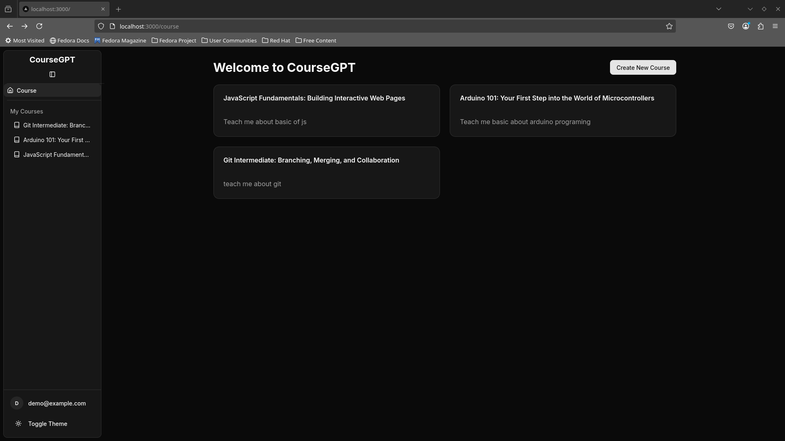
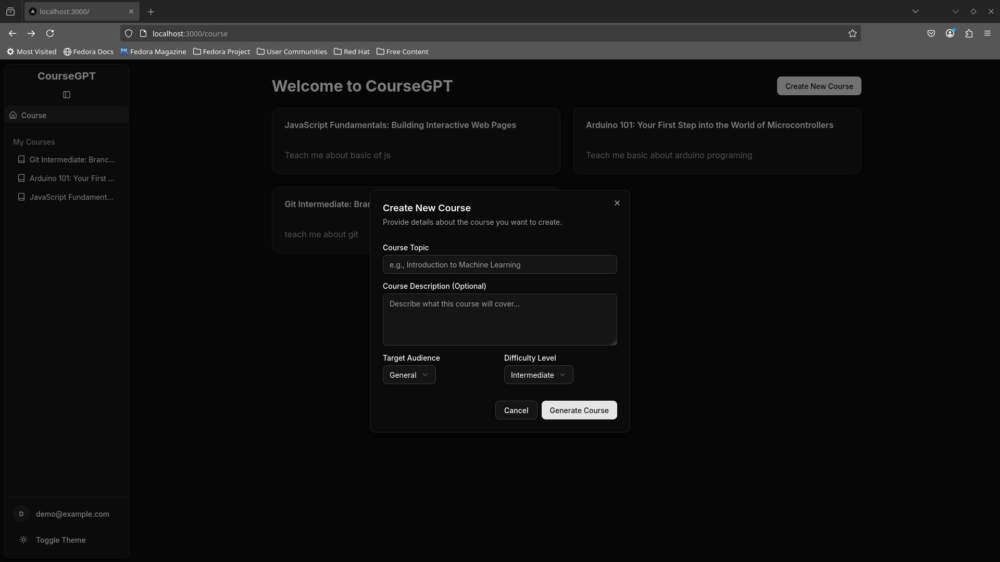
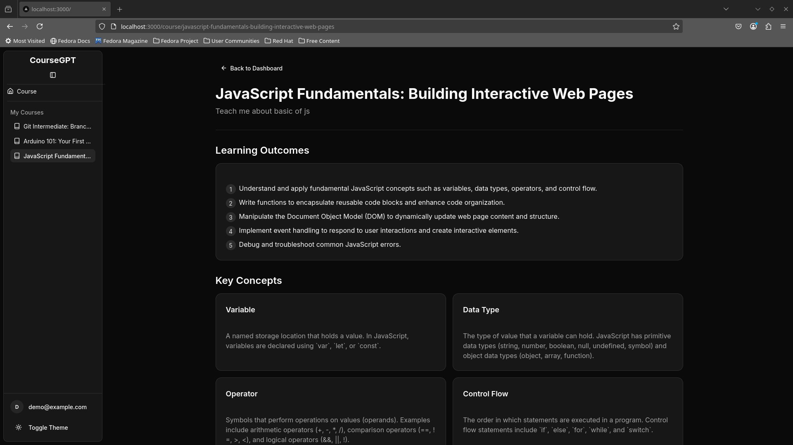
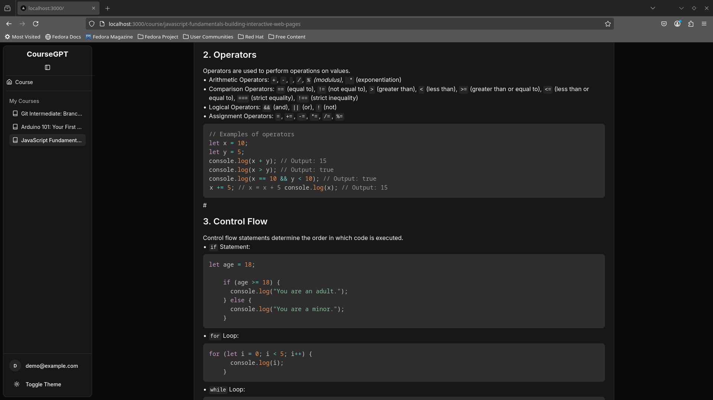

# CourseGPT (Task for kalvium.com)

CourseGPT is an AI-powered learning platform that enables users to generate personalized courses based on their interests and learning goals. Leveraging modern web technologies and AI capabilities, CourseGPT offers an interactive and user-friendly experience for learners.​

## 🚀 Features

- **AI-Generated Courses**: Create tailored courses using AI based on user input.​
- **User Authentication**: Secure login and registration system.​[GitHub]
- **Responsive Design**: Optimized for various devices and screen sizes.​
- **Dark/Light Theme Toggle**: Switch between dark and light modes for comfortable viewing.​
- **Interactive UI**: Engaging and intuitive user interface for seamless navigation.​

## 🛠️ Tech Stack

- **Frontend**: Next.js, Tailwind CSS, ShadCN UI components.
- **Backend**: Supabase for database and authentication services.​
- **State Management**: Zustand for managing application state.​
- **Icons**: Lucide React for scalable vector icons.​

## 📸 Screenshots

## 🧑‍💻 Getting Started

### Prerequisites

- Node.js (v14 or higher)​
- npm or yarn package manager​

### Installation

1.  Clone the repository:​

    `git clone https://github.com/Abhinav-Prajapati/courseGPT.git cd courseGPT`

2.  Install dependencies:

    `npm install # or yarn install`

3.  Set up environment variables:

    Create a `.env.local` file in the root directory and add your Supabase credentials:

    NEXT_PUBLIC_SUPABASE_URL=your_supabase_url
    NEXT_PUBLIC_SUPABASE_ANON_KEY=your_supabase_anon_key
    NEXT_PUBLIC_GEMINI_API_KEY=key_for_gemini_api

4.  Run the development server:​

    `npm run dev # or yarn dev`

Open http://localhost:3000 in your browser to view the application.
